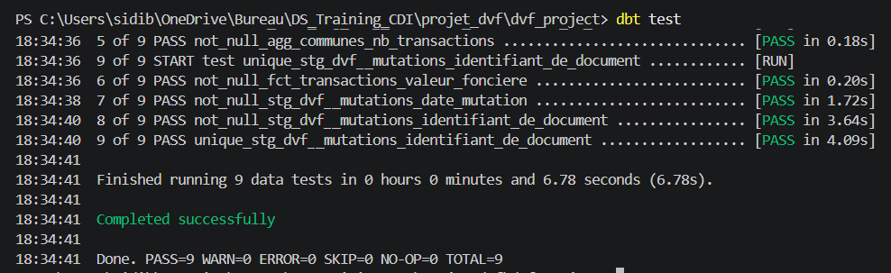
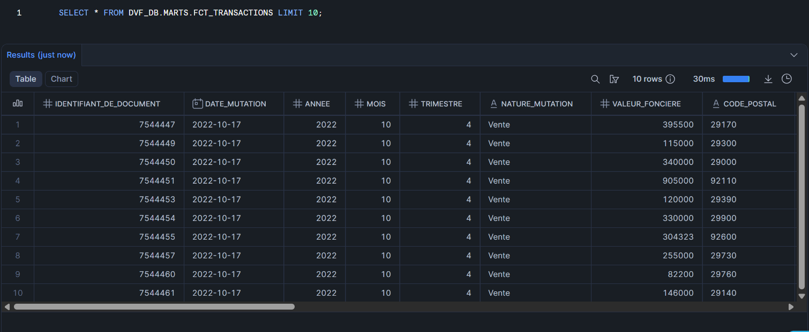
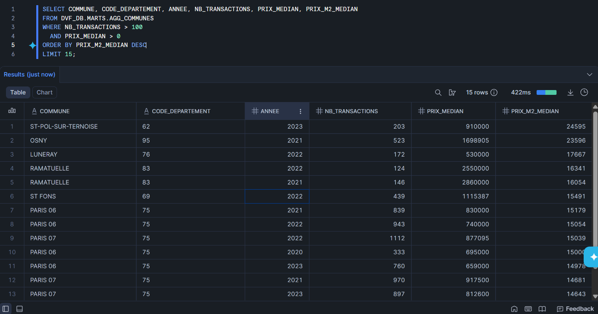

# Projet Data Engineering - Analyse du Marché Immobilier Français (DVF)

[](https://www.getdbt.com/)
[](https://www.snowflake.com/)
[](https://www.python.org/)

## Vue d'ensemble

Pipeline data engineering end-to-end analysant **9+ millions de transactions immobilières françaises** (2020-2023) issues de la base DVF (Demandes de Valeurs Foncières).

**Stack technique** : Snowflake / dbt Core / Python

---

## Architecture

```
┌─────────────┐
│  DVF (txt)  │  2.4 Go
└──────┬──────┘
       │ Python ingestion
       ▼
┌─────────────┐
│  SNOWFLAKE  │
│     RAW     │  15M+ lignes brutes
└──────┬──────┘
       │ dbt run
       ▼
┌─────────────┐
│   STAGING   │  Nettoyage, typage, IDs
└──────┬──────┘
       │
       ▼
┌─────────────┐
│    MARTS    │  fct_transactions / agg_communes
└─────────────┘
```

---

## Résultats

- 5M+ transactions résidentielles après nettoyage (maisons et appartements uniquement)
- 36 000+ communes couvertes sur 4 années (2020-2023)
- Paris 6/7 en tête à 14 000-15 000 €/m², Ramatuelle autour de 16 000 €/m²
- 9 tests qualité automatisés : nulls, unicité, valeurs aberrantes

---

## Pipeline Outputs

### Tests qualité dbt



### fct_transactions — apercu



### agg_communes — top communes par prix/m²



---

## Modeles dbt

### Staging

**stg_dvf\_\_mutations** : union des 4 fichiers annuels, nettoyage des types, gestion des formats français (virgules vers points), génération d'IDs synthétiques pour les lignes sans identifiant.

### Marts

**fct_transactions** : table de faits dédupliquée par mutation (ROW_NUMBER sur identifiant_de_document), filtrée sur les ventes résidentielles uniquement, avec calcul du prix/m² et flags de qualité. Filtres prix appliqués : 1 000 € < valeur < 50 000 000 €, prix/m² entre 500 et 30 000 €.

**agg_communes** : KPIs agrégés par commune et année — prix médian, prix/m² médian, volume de transactions, surfaces médianes, répartition maisons/appartements.

---

## Tests de qualité

9 tests dbt couvrant :

- Nulls sur les colonnes critiques (date_mutation, valeur_fonciere, code_commune)
- Unicité de l'identifiant de document
- Valeurs acceptées sur l'année (2020-2023)
- Cohérence du nombre de transactions

```
dbt test
Done. PASS=9 WARN=0 ERROR=0 SKIP=0 TOTAL=9
```

---

## Installation

### Prérequis

```
Python 3.11+
Compte Snowflake
dbt Core 1.11+
```

### Setup

1. Cloner le repo

```bash
git clone https://github.com/Sidi4PF/projet_dvf.git
cd projet_dvf
```

2. Environnement Python

```bash
python -m venv venv
venv\Scripts\activate
pip install -r requirements.txt
```

3. Variables d'environnement — créer un fichier `.env` à la racine

```
SNOWFLAKE_ACCOUNT=...
SNOWFLAKE_USER=...
SNOWFLAKE_PASSWORD=...
SNOWFLAKE_DATABASE=DVF_DB
SNOWFLAKE_WAREHOUSE=DVF_WH
SNOWFLAKE_SCHEMA=RAW
```

4. Créer les schemas Snowflake

```sql
CREATE DATABASE IF NOT EXISTS DVF_DB;
CREATE WAREHOUSE IF NOT EXISTS DVF_WH WITH WAREHOUSE_SIZE = 'XSMALL';
USE DATABASE DVF_DB;
CREATE SCHEMA IF NOT EXISTS RAW;
CREATE SCHEMA IF NOT EXISTS STAGING;
CREATE SCHEMA IF NOT EXISTS MARTS;
```

5. Configurer dbt — voir la [documentation Snowflake](https://docs.getdbt.com/docs/core/connect-data-platform/snowflake-setup) pour `~/.dbt/profiles.yml`

6. Lancer le pipeline

```bash
python scripts/load_raw_data.py
cd dvf_project
dbt run
dbt test
```

7. Données DVF — télécharger depuis [data.gouv.fr](https://www.data.gouv.fr/fr/datasets/demandes-de-valeurs-foncieres/) et placer dans `data/raw/`

---

## Structure du projet

```
projet_dvf/
├── assets/               # Screenshots et outputs
├── data/
│   └── raw/              # Fichiers DVF sources (non versionnés)
├── scripts/
│   └── load_raw_data.py  # Ingestion Python vers Snowflake
├── dvf_project/          # Projet dbt
│   ├── macros/
│   │   └── generate_schema_name.sql
│   ├── models/
│   │   ├── staging/
│   │   │   ├── stg_dvf__mutations.sql
│   │   │   ├── sources.yml
│   │   │   └── schema.yml
│   │   └── marts/
│   │       ├── fct_transactions.sql
│   │       ├── agg_communes.sql
│   │       └── schema.yml
│   └── dbt_project.yml
├── requirements.txt
├── .gitignore
└── README.md
```

---

## Stack technique

| Technologie | Usage                              |
| ----------- | ---------------------------------- |
| Snowflake   | Data warehouse cloud               |
| dbt Core    | Transformations ELT                |
| Python      | Ingestion des données brutes       |
| pandas      | Lecture et chargement des fichiers |

---

## Source des données

DVF (Demandes de Valeurs Foncières) — Direction Générale des Finances Publiques (DGFiP)
Disponible sur [data.gouv.fr](https://www.data.gouv.fr/fr/datasets/demandes-de-valeurs-foncieres/) sous Licence Ouverte Etalab.
Période couverte : 2020-2023, format .txt pipe-delimited.

---

## Contact

Sidi Amadou Bocoum

- LinkedIn : https://www.linkedin.com/in/sidi-amadou-bocoum-046b691b6/
- GitHub : https://github.com/Sidi4PF
- Email : sidi.bocoum02@gmail.com
